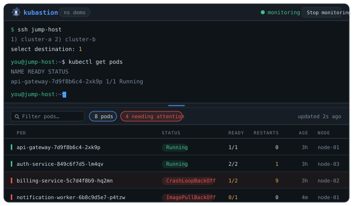

<p align="center">
  
</p>

<h1 align="center">kubastion</h1>

<p align="center">
  <b>A real terminal in your browser. You log into the cluster the way you already do —<br>
  then <code>kubectl get pods</code> turns into a live table.</b>
</p>

<p align="center">
  
  
  
  
  
</p>

<p align="center">
  
</p>

---

## Is this for you?

**Probably not — and that is fine.** If your laptop can reach the cluster's API, stop here
and use [k9s](https://k9scli.io) or [Headlamp](https://headlamp.dev). They are excellent,
mature, and this project is not trying to replace them.

kubastion is for the other situation, the one where those tools cannot help:

| | |
|---|---|
| 🔒 | the cluster API is **not reachable** from your machine |
| 🚪 | you get there through a **bastion / jump host**, often with an **interactive menu** |
| 🧱 | you **cannot install anything** on that remote machine |
| ⏳ | your SSH credential is **short-lived** — it expires every couple of hours |
| ⌨️ | so you retype the same `kubectl` commands all day long |

If every line is true, the rest of this README is about your Tuesday.

<sub>Search terms, so people with this problem can find it: *kubectl through bastion*,
*kubernetes UI without API access*, *k9s jump host*, *kubectl over ssh dashboard*,
*kubernetes dashboard behind jump server menu*.</sub>

---

## How it works

Four things happen, in this order — and **only the last two are automated**.

### 1. A real terminal, in the browser

Not a command box: a genuine pseudo-terminal ([pty4j](https://github.com/JetBrains/pty4j),
ConPTY on Windows) streamed to [xterm.js](https://xtermjs.org) over a WebSocket. It is the
same machinery behind IntelliJ's terminal.

That matters because a plain `exec` cannot do what your login needs. Interactive menus,
password prompts, `ssh` asking to confirm a host key, curses UIs, colours, `Ctrl+C` — all
of it needs a TTY on the other end. With a PTY, everything behaves exactly as in your
normal terminal, because it *is* one.

### 2. You log in. All of it. By hand.

Load the key, run `ssh`, walk the gateway menu, pick the destination, answer the MFA
prompt — whatever your environment throws at you. kubastion watches none of it and
automates none of it.

**This is the design, not a missing feature.** Corporate gateways are unknowable: every
company has a different menu, a different banner, a different number of hops. Any tool
that tries to script that login works at one company and breaks at the next. By staying
out of the way, kubastion works with gateways it has never heard of — including yours.

### 3. Press *Start monitoring*

Now that you are on the machine, kubastion starts doing the boring part: every 3 seconds
it runs `kubectl get pods -o json` **in the session you just opened**, parses the result
and renders it.

```
browser                    kubastion (localhost)            your gateway        cluster
┌──────────┐  websocket   ┌───────────────────┐   PTY      ┌──────────┐        ┌───────┐
│ xterm.js │ ◄──────────► │  terminal session │ ◄────────► │  ssh …   │ ─────► │  API  │
└──────────┘              │                   │            │  menu    │        └───────┘
┌──────────┐  websocket   │  every 3s, hidden:│            │  kubectl │
│ pod table│ ◄─────────── │  kubectl get pods │            └──────────┘
└──────────┘              └───────────────────┘
```

The polled command and its output are **hidden from the terminal**, so your session stays
readable instead of being flooded with JSON every three seconds. Keeping the two apart is
the one genuinely tricky part of this project:

```
echo "__KB<id>""S__"; kubectl -n <ns> get pods -o json 2>&1; echo "__KB<id>""E__"
```

A random id per command, and the markers **split across two adjacent strings** on purpose.
A PTY echoes the command line back before running it; if the literal markers appeared in
that echo, the capture would close on the echo instead of on the real output. Split like
this, the echo shows `"__KB…""S__"` while `echo` *prints* `__KB…S__` — only the output
carries the real marker.

> **The injected command assumes a POSIX shell** (`;`, `2>&1`, string concatenation). That
> is the point: by the time you press *Start monitoring* you are on the remote Linux
> machine. Keep `terminal.command` empty so the local shell stays your OS default.

### 4. Click a pod, get the command you were going to type anyway

Clicking a row opens a window with **Logs**, **Logs (previous)**, **Describe**, **Events**
and **YAML** for that pod. The toolbar picker runs the namespace-wide ones: events,
deployments, services, ingresses, configmaps, secrets, nodes, top pods.

The window always prints **the exact kubectl line that ran**, above its output. You should
never have to guess what kubastion typed into your session on your behalf.

Two rules hold for every one of them:

- **Read-only.** No apply, no delete, no scale, no edit, no exec. A test walks the whole
  catalogue and fails the build if a writing verb ever appears in it. You have a terminal
  right there and your own credentials; kubastion should not be the thing that made a
  mistake easy.
- **Never a secret's value.** `Secrets` lists names, types and key counts. Reading one
  would print a live credential into a browser tab, so the catalogue simply contains no
  command that can.

The browser never sends a command line — only an id from a fixed list and, at most, a pod
name, which is validated against injection before it goes anywhere near the shell.

### The session is yours, not the poller's

This is the part that makes it usable rather than infuriating. While **you** are using the
terminal, nothing is injected into it:

- a **half-typed line** pauses polling entirely — type `kubectl get pods -n `, go make
  coffee, come back, and your line is exactly where you left it
- so does **recent typing**, and **output still arriving** from a command of yours (so
  `tail -f` does not get interrupted by a poll)
- the status bar says which of those it is, and polling resumes on its own the moment the
  session goes quiet

And the polled command's own output is hidden, *including the prompt the shell reprints
afterwards* — otherwise a two-line prompt would fill your scrollback at twenty lines a
minute.

### What the table actually tells you

`phase` alone lies. A pod whose phase is `Running` can have a container in
`CrashLoopBackOff`, and showing "Running" there would be the most damaging bug this project
could ship. So the projection applies precedence rules, each one pinned by a test:

- a **container reason** (`CrashLoopBackOff`, `ImagePullBackOff`, `OOMKilled`) beats the phase
- a **`deletionTimestamp`** beats everything: the pod shows `Terminating`, and never green
- **restarts are summed** across containers — `2 + 7` is `9`, not `7`
- `ContainerCreating` is **not** a problem: a deployment must not paint the table red
- no `containerStatuses` yet shows `—`, not a misleading `0/0`

The colour of a row and the word in it can never disagree. That is the whole contract.

### When the credential expires

It will, mid-session, roughly every two hours. Nothing dramatic happens: the poll fails,
the table freezes with an amber *updated 2m ago*, and a banner tells you **what to do**
rather than what went wrong.

| what the remote says | what you read |
|---|---|
| `Permission denied (publickey)` | SSH credential expired or invalid. Reload your key (`ssh-add`) — monitoring resumes by itself. |
| `Could not resolve hostname …` | Jump host cannot be resolved. Are you connected to the VPN? |
| `Unable to connect to the server` | kubectl cannot reach the cluster: the cluster credentials have expired. |
| `pods is forbidden` | Not enough permissions on that namespace. |

You reload your key in the terminal, and the next poll simply succeeds. No reconnect
dance, no losing your place.

---

## Security: it never touches your credentials

This is the first thing your security team will ask, so it is the first thing documented.

- kubastion **never asks for, stores, reads or transmits your key, password or OTP.** It
  opens a local shell and gets out of the way; you type into it as you would into any
  terminal.
- It **does not extend the lifetime of any credential** and makes no attempt to work around
  expiry. The honest product is *lose less work when it expires*, never *make it expire
  less often*.
- It binds `127.0.0.1` only and talks to nothing else. **No telemetry, no network calls,
  no accounts.**
- Everything that reaches the remote shell is validated against injection first: a
  namespace of `demo; rm -rf /` is rejected at startup, and a pod name of
  ``api`id` `` is rejected on the way in.
- **The browser cannot compose a command.** It sends an id from a fixed catalogue and at
  most a pod name; the command line is built on the backend and printed back to you.
- **Everything it can run is read-only, and none of it can read a secret's value.** Both
  are enforced by tests over the whole catalogue, not by convention.

---

## Quick start

Clone it and run **one file**. It checks the prerequisites, creates `config.yml` from the
example, installs the frontend dependencies on first run, starts both processes, waits
until each one actually answers, and opens the browser. `Ctrl+C` stops both.

**Windows** — double-click **`start.bat`**, or:

```powershell
.\start.ps1
```

**macOS / Linux**

```bash
./start.sh
```

Then set your namespace in `config.yml` (git-ignored) and restart.

**Requirements:** Java 21+ and Node 20+. Nothing else — Maven ships with the repo via the
wrapper, and **nothing at all needs to be installed on the remote machine.**

<details>
<summary>Starting the two processes by hand</summary>

```bash
cp config.example.yml config.yml     # then edit it — config.yml is git-ignored
cd backend  && ./mvnw spring-boot:run
cd frontend && npm install && npm start
```

Then open <http://localhost:4200>.

</details>

<details>
<summary>Why <code>.bat</code> and not <code>.exe</code></summary>

A `.exe` would have to be compiled and code-signed to get past SmartScreen, and in an open
source repository you should be able to read what you are about to run. `start.bat` is
four lines; the work happens in `start.ps1` next to it, in plain text.

</details>

### Configuration

Everything lives in `config.yml` at the project root. It is git-ignored on purpose:
**real hostnames, namespaces and internal URLs must never end up in this repository.**
Only `config.example.yml`, with placeholders, is versioned.

| key | what it is | default |
|---|---|---|
| `terminal.command` | local shell to open. Empty = your OS default (PowerShell / `$SHELL`) | `""` |
| `terminal.args` | arguments for it | `[]` |
| `kubectl.binary` | path to kubectl **on the remote machine** | `kubectl` |
| `kubectl.namespace` | namespace to watch | `default` |
| `kubectl.context` | optional `--context`; empty uses the remote default | `""` |
| `monitor.interval-seconds` | how often the command runs | `3` |
| `monitor.timeout-seconds` | past this a command is considered lost and the terminal is handed back to you | `15` |
| `monitor.quiet-seconds` | how long the terminal must be quiet before anything is injected. A half-typed line pauses polling whatever this says; `0` only turns off the timer | `2` |

<sub>All keys are under `kubastion:`.</sub>

---

## Under the hood

```
backend/    Spring Boot 3.3 · Java 21 · no Lombok (records instead)
  terminal/   PTY session, marker injection, output suppression, "are you typing?"
  pods/       PodListParser (pure, tested), PodView projection, 3s poller
  kubectl/    the command catalogue + injection-proof validation
  ssh/        turning raw ssh/kubectl errors into sentences worth reading
  web/        two WebSockets (terminal bytes, pod JSON) + a small REST API
frontend/   Angular 18 standalone · signals · xterm.js · light and dark
start.bat · start.ps1 · start.sh
```

Two WebSockets rather than one: the terminal carries raw bytes at keystroke rate, the pod
channel carries a JSON snapshot every three seconds. Different volume, different purpose,
so a flood of terminal output can never delay a snapshot.

**Why 3-second polling and not `kubectl --watch`?** Because there is exactly one session,
and it is *yours*. A blocking `--watch` would hold the terminal hostage until you killed
it. A short command that starts and finishes leaves the session yours between polls.

```bash
cd backend && ./mvnw test     # 77 tests, no cluster required
```

The tests cover the parts that fail quietly: terminal noise and ANSI stripping, kubectl
errors arriving where JSON was expected, shell-injection attempts in both configuration
and pod names, whether a keystroke counts as "you are mid-command", and every status
precedence rule above. Two of them started as real bugs — a `Terminating` pod rendered
green, and a JSON token split in half by a terminal that wrapped the line.

---

## Non-goals

Keeping this list honest is how the project stays small enough to be maintained by one
person.

- Not a k9s or Headlamp replacement — if you can reach the API, use those.
- No credential handling, storage, or automation of any kind.
- No cluster mutation: no `apply`, no `delete`, no `scale`, no `exec`.
- No free-text command box. The catalogue is the feature.
- No multi-cluster, no plugins, no accounts, no telemetry.

## Roadmap

Next, in order: **follow logs live** rather than a fixed tail, a namespace picker, and
saving a filter you keep retyping. Deliberately not started until the above has been used
in anger.

## Status

Early, but verified end to end: PTY, interactive shell, command injection, output capture,
JSON parsing, the live grid and the command window all work, with tests around the parts
that break silently.

What has *not* been exercised yet is a real corporate gateway — that is the next thing to
find out, and the most useful thing you could report. One known rough edge: on Windows the
local shell runs behind ConPTY, which re-renders its screen buffer, so resizing the window
during a poll can briefly echo output that was meant to stay hidden.

## License

[MIT](LICENSE).
